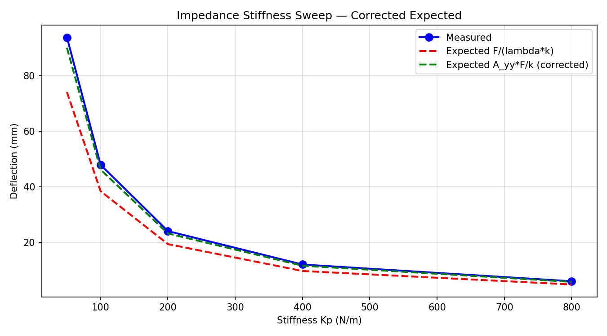
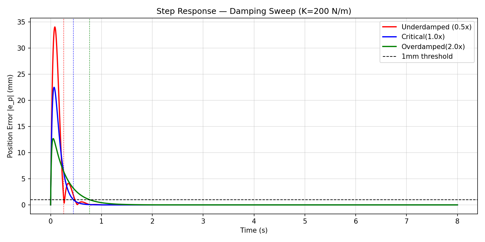
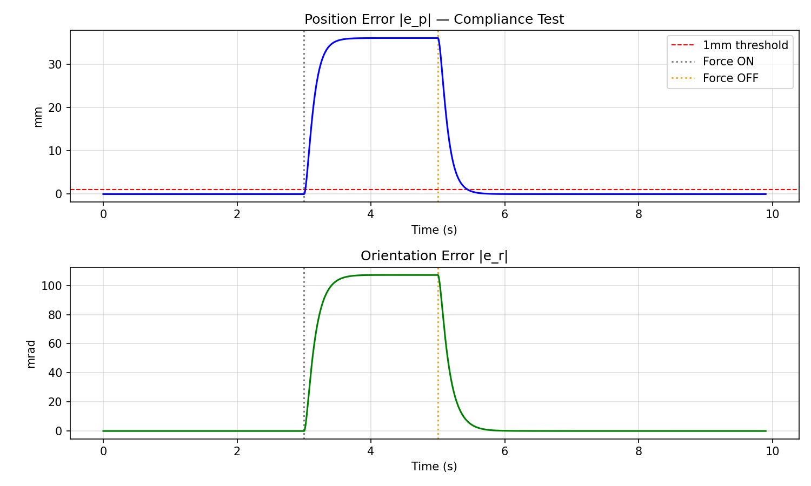
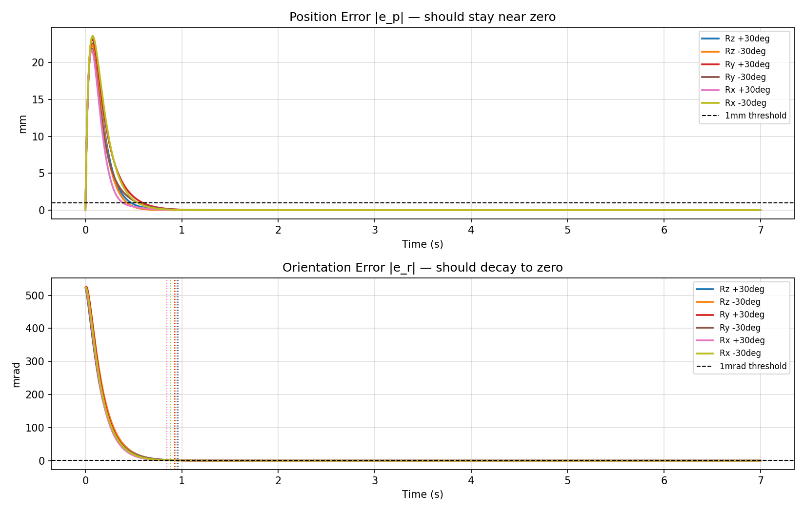
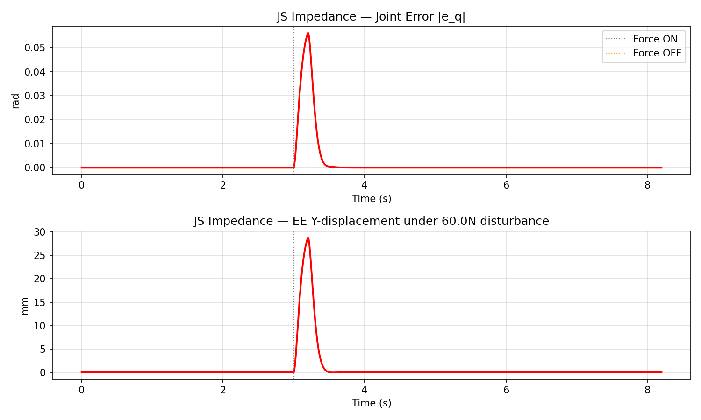
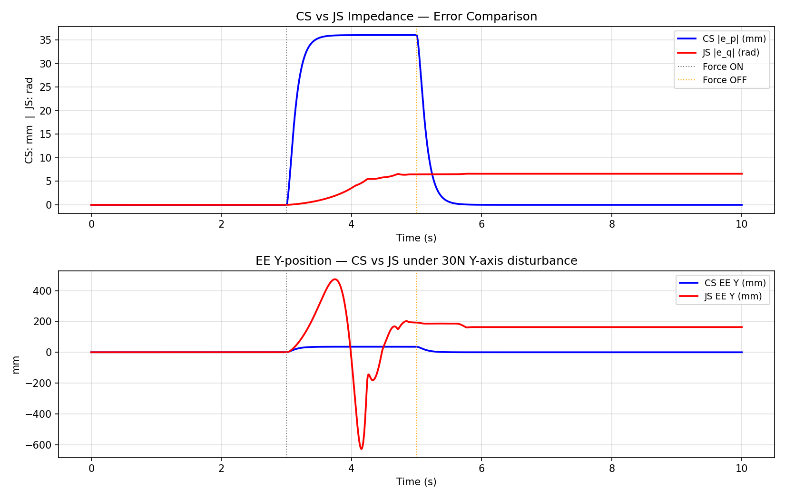
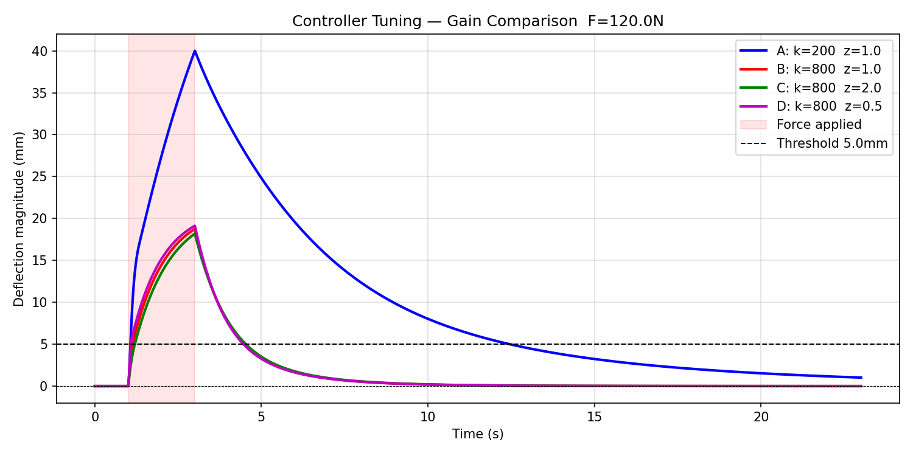
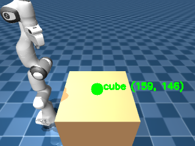

# Bathsheba Project RoboAI

A robotics project focused on 7-DOF manipulator control, planning, and perception for compliant robotic manipulation. The repository includes custom kinematic and trajectory tooling, impedance controllers, environment setups, and perception utilities for robot interaction tasks.

## Overview

- Custom kinematic stack for 7-DOF manipulators
- Verified inverse kinematics (IK) solvers
- Impedance control architectures for compliant manipulation
- Perception pipeline for pose estimation and camera-based object detection
- Simulation and trajectory planning support for robotic tasks

## Repository structure

```text
Bathsheba-Project-roboai/
├── README.md
├── requirements.txt
├── assets/
│   ├── menagerie/
│   ├── mujoco_api_reference.txt
│   └── scene_pick.xml
├── control/
│   ├── __init__.py
│   ├── CS_impedance_controller.py
│   ├── grasp_check.py
│   └── JS_impedance_controller.py
├── envs/
│   ├── __init__.py
│   └── reach_env.py
├── perception/
│   ├── __init__.py
│   ├── camera_stream.py
│   ├── detector.py
│   └── pose_estimator.py
├── planning/
│   ├── __init__.py
│   ├── cartesian_trajectory.py
│   ├── fk.py
│   ├── ik.py
│   └── trajectory.py
├── scripts/
│   ├── run.py
│   └── test_control_planning/
│       ├── test_cartesian_trajectory.py
│       ├── test_circle.py
│       ├── test_trajectory.py
│       ├── test1_setpointtracking.py
│       ├── test2_dampingandsweep.py
│       ├── test3_orientationtracking.py
│       └── test4_JSImpedance.py
├── test_perception/
│   └── test_pose_estimator.py
└── utils/
    ├── __init__.py
    └── transform.py
```

## Folder breakdown

### control/
Contains robot control logic, including compliant impedance controllers and grasp checks.

### envs/
Defines simulation and task environments used for robot interaction experiments.

### perception/
Includes camera streaming, object detection, and pose estimation utilities.

### planning/
Contains forward and inverse kinematics, trajectory generation, and Cartesian planning logic.

### scripts/
Houses runnable scripts and test cases for control, trajectory planning, and evaluation.

### utils/
General helper functions, such as transforms and geometric utilities.

### assets/
Static assets, scene descriptions, and supporting reference files for simulation or experiments.

## Setup

Install dependencies:

```bash
pip install -r requirements.txt
```

## Results

All values below are read off the plots in [assets/](assets/) and are approximate. Experiments were run in MuJoCo on the Franka Emika Panda.

### Cartesian-space (CS) impedance control

**Stiffness sweep** (`test2_stiffness_v4.png`): the measured deflection under a fixed force falls from about 94 mm at Kp = 50 N/m to about 6 mm at Kp = 800 N/m. The naive prediction F/(λ·k) underestimates deflection, especially at low stiffness. The corrected prediction A_yy·F/k, which uses the task-space inertia term, tracks the measurements closely across the whole range.



**Damping sweep** (`test3_damping_sweep.png`, K = 200 N/m): all three damping ratios converge to zero error and reach the 1 mm threshold within about 0.8 s.

| Damping | Peak error | Behaviour |
|---|---|---|
| Underdamped (0.5×) | ~34 mm | Oscillates and overshoots, settles at ~0.3 s |
| Critical (1.0×) | ~22 mm | No overshoot, settles at ~0.45 s |
| Overdamped (2.0×) | ~13 mm | Lowest peak, slowest, settles at ~0.8 s |



**Compliance test** (`test4_compliance.png`): a force is applied from t = 3 s to t = 5 s.
- Position error rises to a steady ~36 mm and orientation error to ~107 mrad. The end effector yields instead of fighting the load.
- Both errors return to below the 1 mm threshold within about 0.5 s of release, so there is no permanent offset.



**Manual disturbance** (`test4_manual_disturbance.png`): the end effector was dragged by hand in the viewer. Position error peaked at about 77 mm and orientation error at about 330 mrad. After each drag the arm returned to the setpoint.

**Orientation tracking** (`test5_orientation_tracking.png`): ±30° step commands about x, y and z all behave the same way.
- Orientation error starts at about 524 mrad (30°) and drops below 1 mrad in roughly 0.85–0.95 s.
- Position error shows a transient of about 22–24 mm, peaking at about 0.07 s, and settles within 1 mm in about 0.4–0.6 s.



### Joint-space (JS) impedance control

**Disturbance rejection** (`test6_js_per_joint.png`): a 60 N disturbance applied for about 0.2 s gives a peak joint error of about 0.056 rad and an end-effector Y deflection of about 29 mm. Both return to zero within about 0.5 s.



**CS vs JS comparison** (`test6_cs_vs_js.png`): a 30 N Y-axis force is applied from t = 3 s to t = 5 s.
- CS impedance gives a bounded, predictable deflection of about 36 mm. The end effector returns fully to the setpoint after release.
- JS impedance has no Cartesian-space guarantee. The end-effector Y position swings from roughly +470 mm to −630 mm. The arm also fails to recover and ends at about 165 mm from the setpoint, with a residual joint error of about 6.5 rad.
- In this setup, Cartesian impedance is the better choice for compliant interaction with external forces.



**Gain tuning under a 120 N load** (`controller_tuning.png`): force applied from t = 1 s to t = 3 s, with a 5 mm settling threshold.

| Config | Behaviour |
|---|---|
| A: k = 200, ζ = 1.0 | Largest deflection, peaking at about 370 mm |
| B: k = 800, ζ = 1.0 | Peaks of about 230 mm, then about 40 mm |
| C: k = 800, ζ = 2.0 | Smoothest, holding at about 145 mm then dropping to about 40 mm |
| D: k = 800, ζ = 0.5 | Spiky, with peaks of about 300 mm |

All four return to the low-millimetre range after the force is removed. A small noise floor of a few mm remains in each case.



### Perception

The camera pipeline detects the red cube on the table in the MuJoCo scene (`detection_debug.png`). It reports the cube's pixel centroid, about (319, 292) in the 640×480 frame. Debug views of the mask, the corner points and the estimated pose are also in `assets/`.



## Notes

- Initial validation was performed on a Franka Emika Panda 7-DOF robotic arm.
- The repository is actively evolving, especially around perception and vision stack integration.
- Contributions are welcome.

